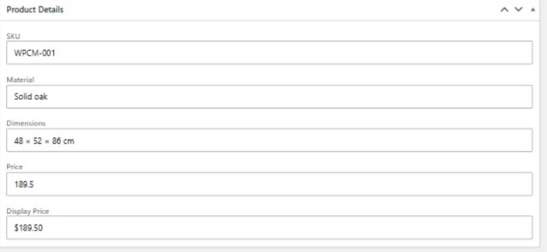
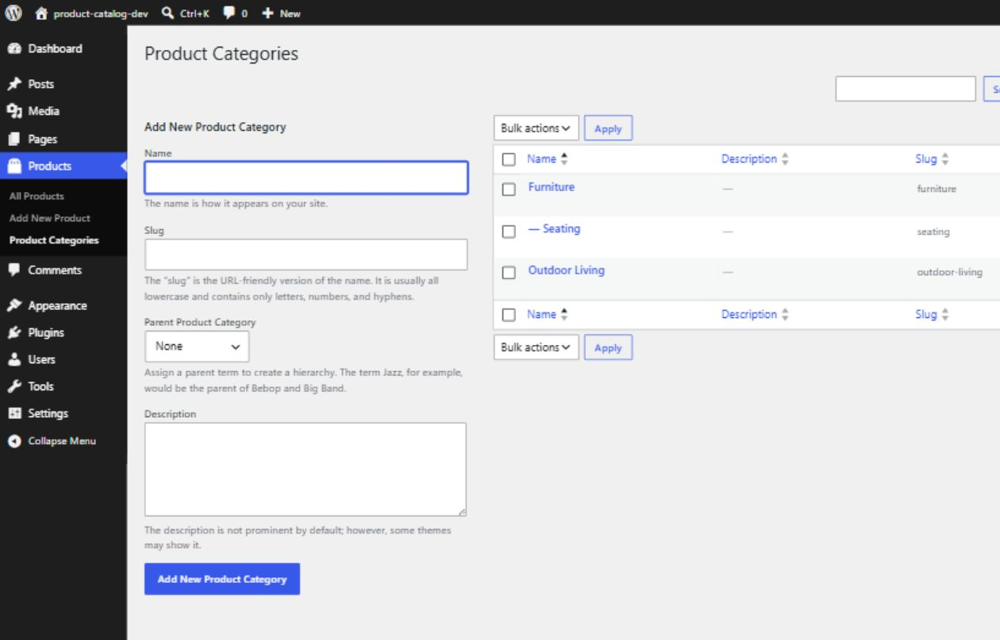
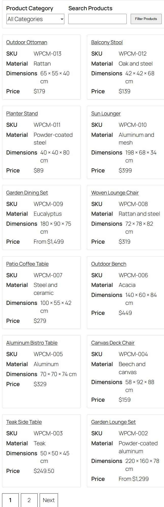
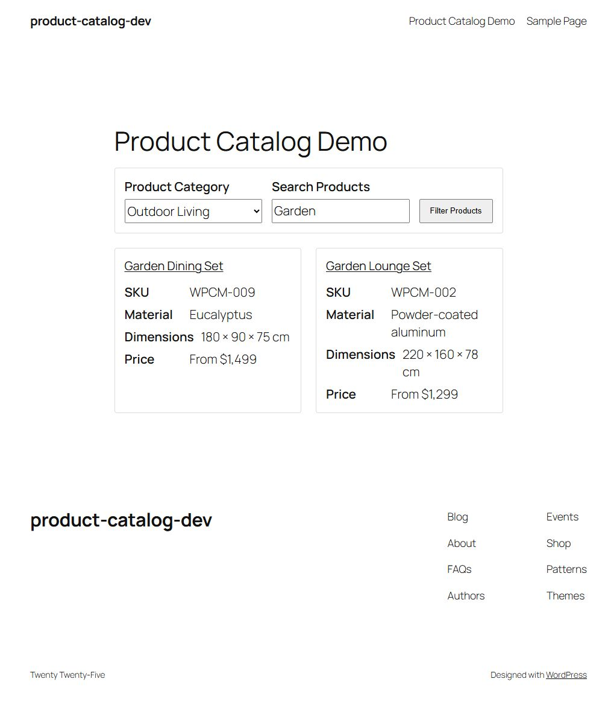

# WP Product Catalog Manager

WP Product Catalog Manager is a lightweight, WordPress-native product catalog plugin. It provides structured Product entries, hierarchical Product Categories, secure product details, and a responsive searchable catalog without custom database tables or frontend JavaScript.

Current version: **0.1.0**

## Key features

- Public, admin-manageable `wpcm_product` custom post type.
- Hierarchical `wpcm_product_category` taxonomy attached only to Products.
- Title, editor, and featured-image support.
- A Product Details meta box with SKU, Material, Dimensions, Price, and Display Price fields.
- Secure metadata saving with nonce, post-type, autosave, revision, and `edit_post` capability checks.
- `[wpcm_catalog]` shortcode for published Products.
- Product Category filtering, keyword search, and pagination.
- Twelve Products per catalog page.
- Responsive, container-aware product grid.
- Escaped frontend output and translation-ready strings.
- Conditional catalog stylesheet loading.

## WordPress-native architecture

The plugin uses WordPress custom post types, taxonomies, post metadata, shortcodes, `WP_Query`, template APIs, and enqueue APIs. Product data remains in WordPress core tables; the plugin creates no custom database tables.

Responsibilities are separated into focused classes:

- `WPCM_Plugin` coordinates hooks and text-domain loading.
- `WPCM_Post_Type` registers Products.
- `WPCM_Taxonomy` registers Product Categories.
- `WPCM_Meta_Boxes` renders and securely saves Product Details.
- `WPCM_Shortcode` validates catalog requests, queries Products, and renders the catalog template.
- `WPCM_Assets` conditionally enqueues catalog CSS.

## Security approach

- Executable PHP files reject direct access.
- Product Details require a dedicated nonce and `current_user_can( 'edit_post', $post_id )`.
- Autosaves, revisions, wrong post types, malformed request types, and invalid nonces are ignored.
- Request values are unslashed before sanitization.
- Text fields use `sanitize_text_field()`.
- Price accepts non-negative decimal strings and is normalized without floating-point storage.
- Catalog category input is sanitized and validated against the Product Category taxonomy.
- Catalog page input is constrained to a positive integer with an upper bound.
- Dynamic frontend values are escaped for their output context; allowed thumbnail and pagination markup passes through `wp_kses_post()`.
- Catalog query arguments are controlled by the plugin and cannot be replaced through request parameters.

## Requirements

- WordPress 6.0 or later.
- PHP 7.4 or later.
- A theme with featured-image support is recommended for product imagery.

These are the plugin's declared minimum requirements; this repository does not claim a broader tested compatibility range.

## Installation

1. Copy the `wp-product-catalog-manager` directory into `wp-content/plugins/`.
2. In WordPress admin, open **Plugins**.
3. Activate **WP Product Catalog Manager**.
4. Add Product Categories and Product entries as needed.
5. Create or edit a page and add the `[wpcm_catalog]` shortcode.
6. Publish the page and view the catalog on the frontend.

No activation migration or custom-table setup is required.

## Creating Products

1. In WordPress admin, open **Products → Add New**.
2. Enter the Product title and optional editor content.
3. Complete any Product Details fields you need.
4. Assign one or more Product Categories.
5. Set a featured image if desired.
6. Publish the Product.

Only published Products appear in the shortcode catalog.

### Product fields

| Field | Purpose |
| --- | --- |
| SKU | A plain-text product identifier. |
| Material | A plain-text material description. |
| Dimensions | Plain-text dimensions in the format appropriate to the catalog. |
| Price | A validated non-negative decimal value, stored as a normalized string. |
| Display Price | Optional presentation text such as `$129.00`, `From $129`, or `Contact for price`. When present, it is displayed instead of Price. |
| Featured Image | The product image shown in the catalog grid. |

Submitting an empty Product Details field removes only that field's plugin-owned post meta. Invalid Price input does not overwrite a valid stored Price.

## Product Categories

Product Categories are hierarchical, so parent and child categories can be created in **Products → Product Categories**. They are attached only to the Product post type.

The catalog filter lists available Product Categories. A selected category is validated against `wpcm_product_category` before it is added to the query.

## Catalog shortcode

Add the shortcode to a WordPress page:

```text
[wpcm_catalog]
```

The shortcode does not define attributes. It renders:

- A Product Category selector.
- A keyword search field.
- A responsive Product grid.
- Pagination when more than twelve matching Products exist.

### Filtering, search, and pagination

Filtering uses three namespaced query parameters managed by the plugin:

- `wpcm_category` for a validated Product Category slug.
- `wpcm_search` for a sanitized keyword search.
- `wpcm_page` for a controlled positive catalog page number.

Pagination preserves only the approved sanitized category and search state. Filtering is request-based and reloads the page; there is no AJAX or live-search behavior.

### Responsive layout

The catalog uses a container-aware CSS Grid. Cards automatically fit into one, two, or more columns when the catalog's available width can accommodate a readable minimum card width. This avoids forcing narrow cards when a theme uses a constrained content column on an otherwise wide viewport.

`assets/css/frontend.css` is enqueued only on a singular page whose content contains `[wpcm_catalog]`. `assets/js/frontend.js` remains an inert, unenqueued placeholder.

## Example setup

1. Create parent categories such as **Furniture** and **Outdoor Living**.
2. Add Products such as **Oak Dining Chair** and **Garden Lounge Set**.
3. Enter SKU, material, dimensions, numeric Price, and optional Display Price values.
4. Assign Product Categories and featured images.
5. Publish a page named **Catalog** containing `[wpcm_catalog]`.
6. Use the frontend category selector or keyword field to narrow results and pagination to move through larger catalogs.

## Screenshots

These captures use generic demonstration content from a local WordPress installation.

### Product Details editor



### Product Categories



### Catalog grid and pagination



### Category filtering and keyword search



## Project structure

```text
wp-product-catalog-manager/
├── assets/
│   ├── css/frontend.css
│   └── js/frontend.js
├── docs/
│   └── screenshots/
│       ├── screenshot-1-product-editor.png
│       ├── screenshot-2-product-categories.png
│       ├── screenshot-3-catalog-grid.png
│       └── screenshot-4-catalog-filters.png
├── includes/
│   ├── class-wpcm-assets.php
│   ├── class-wpcm-meta-boxes.php
│   ├── class-wpcm-plugin.php
│   ├── class-wpcm-post-type.php
│   ├── class-wpcm-shortcode.php
│   └── class-wpcm-taxonomy.php
├── languages/.gitkeep
├── templates/catalog-grid.php
├── AGENTS.md
├── README.md
├── readme.txt
├── uninstall.php
└── wp-product-catalog-manager.php
```

## Development and security notes

- Follow the project specification in `AGENTS.md`.
- Keep the `WPCM_` class/constant prefix and `wpcm_` public identifier prefix.
- Use `wp-product-catalog-manager` for all translatable runtime strings.
- Preserve output-context escaping and the existing nonce/capability checks.
- Run PHP syntax lint on every PHP file after changes.
- Do not add custom database tables.

## Internationalization

Runtime strings use the `wp-product-catalog-manager` text domain. The plugin declares `Domain Path: /languages` and loads translations from the `languages` directory on `init` before translated registration labels are built.

## Uninstall behavior

The current MVP creates no WordPress options, so uninstall performs no data deletion. It does not delete Product posts, Product Categories, Product metadata, featured images, users, unrelated options, or database tables.

If plugin-owned options are introduced in the future, each option must be explicitly allowlisted in `uninstall.php` before WordPress option APIs may delete it.

## Current MVP limitations

- No shortcode attributes or sorting controls.
- No price or material filters.
- No settings screen.
- No custom single-Product template; the active theme controls individual Product presentation.
- No frontend JavaScript behavior or AJAX filtering.
- No product-data deletion during uninstall.

The following stretch features are explicitly not implemented:

- REST API endpoints.
- CSV import/export.
- AJAX or live filtering.
- Custom single-Product templates.
- PDF uploads.

## License

WP Product Catalog Manager is licensed under the GNU General Public License v2 or later (`GPL-2.0-or-later`).

## Changelog and milestone summary

### 0.1.0

- Scaffolded the plugin architecture and bootstrap.
- Registered the Product post type and Product Category taxonomy.
- Added secure Product Details fields and save handling.
- Added the catalog shortcode and responsive grid.
- Added category filtering, keyword search, and pagination.
- Hardened request validation, sanitization, escaping, and capability checks.
- Added translation loading and a conservative uninstall policy.
- Replaced scaffold documentation with completed-MVP usage and architecture guidance.
- Added real WordPress screenshots covering Product Details, Product Categories, the catalog grid, filtering, search, and pagination.
